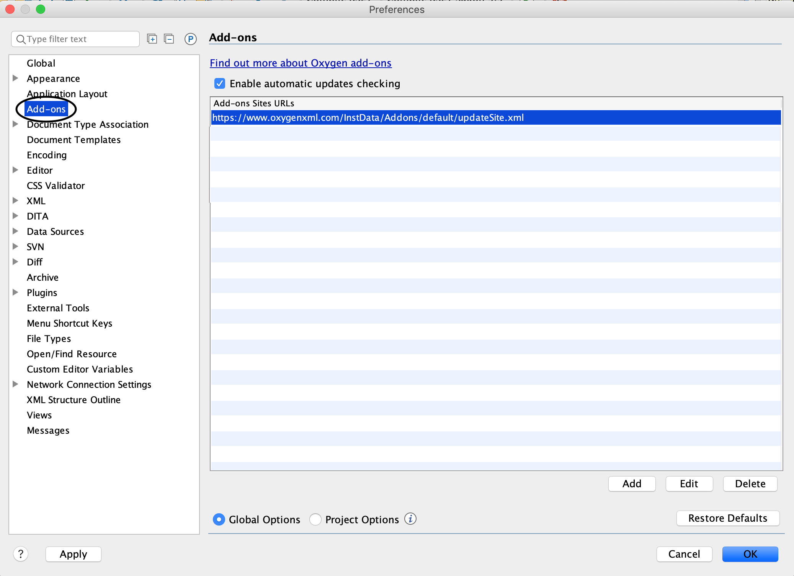
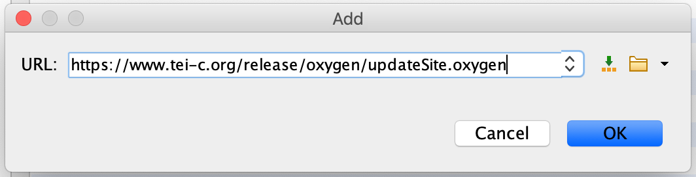
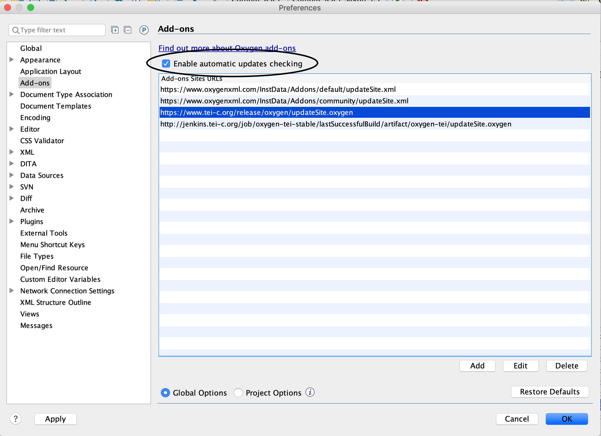
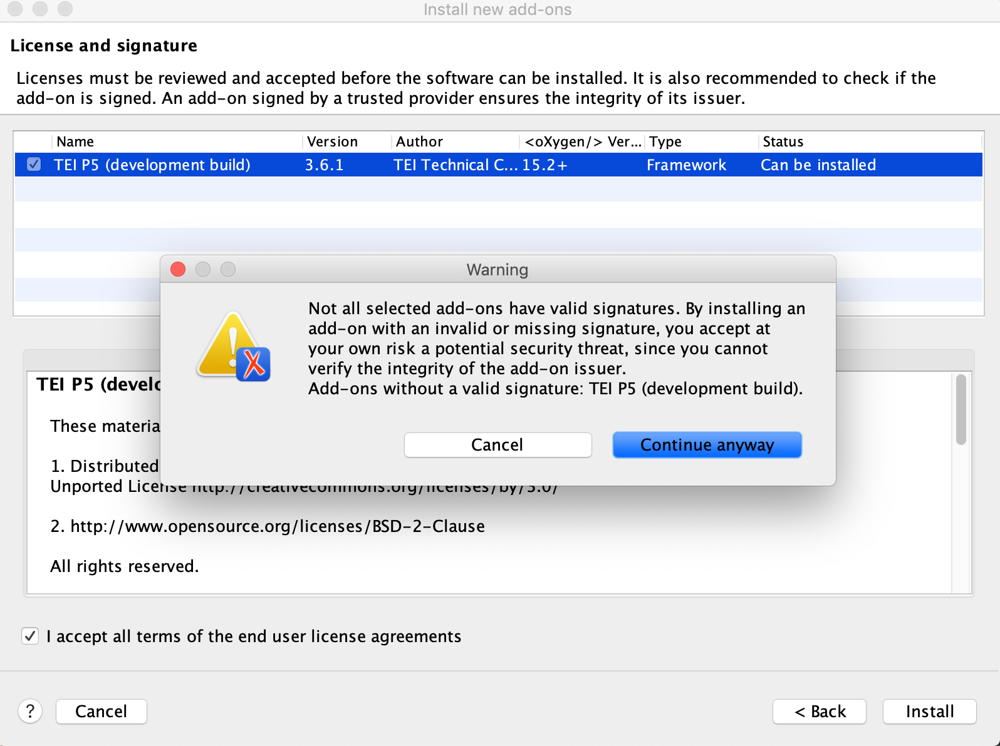

# How to automatically update your TEI framework in oXygen

Much of the TEI community relies on the [&lt;oXygen/&gt; XML Editor](https://www.oxygenxml.com/) to provide the most up-to-date frameworks for the TEI, including element specs, schema validation rules, and transformation scenarios packaged with the latest releases of the TEI Guidelines. The [TEI Consortium](https://tei-c.org) and &lt;oXygen/&gt; jointly maintain an open source and openly-licensed oxygen-tei framework at <https://github.com/TEIC/oxygen-tei>.

In this guide, we explain how to add and install the oXygen TEI plugin to  keep the TEI framework up to date with new releases of the TEI Guidelines and Stylesheets. Keeping your framework up to date will ensure that your TEI projects are checked for validity against updates to the TEI-All schema and that you have access to the latest additions (new elements and attributes for example) in the TEI Guidelines. Releases of the TEI Guidelines come roughly twice per year and the oXygen TEI plugin will help ensure you have access to the latest release of the TEI source code. Follow the steps outlined here to install the oXygen TEI plugin.

1. You can add the the plugin from either the Help menu or the Options menu. In the Help Menu, select “Install new add-ons...”. Alternatively, in the Options menu, select Preferences. Then select Add-ons, as shown in the figure below. 

2. Click on the Add button to add a new Add-on, and in the pop-up window that appears, paste in this URL: **https://www.tei-c.org/release/oxygen/updateSite.oxygen**. This is the oXygen-TEI add-on file which is updated every time there is a TEI Guidelines or Stylesheets release. Click <q>OK</q> to add it to your list of available add-ons.

3. Back in the Preferences window in Add-ons, be sure that the <q>Enable automatic updates checking</q> is checked, and click <q>OK</q>. 

4. Now we need to install the add-on. In the Help menu, click on <q>Install new add-ons...</q>, and check the boxes at the bottom for <q>Show only compatible add-ons</q> and <q>Show only the latest versions of the add-ons</q>. Then paste in the same URL that we did before: **https://www.tei-c.org/release/oxygen/updateSite.oxygen"**. (If you deselect <q>Show only the latest versions of the add-ons</q>, you will see several older versions associated with different releases of the TEI. Select the version of the add-on that you want, which is usually the most recent one.) Click the checkbox next to the name of the plugin, so that your screen looks like our figure below. Then click <q>Next</q>.

5. You will now be prompted to click a checkbox to accept the license for the plugin. Doing so will raise a warning that the license is lacking a valid signature. If you trust the TEI Consortium, click <q>Continue anyway</q> as shown below.

6. You will now be told, <q>To apply these changes, you must restart the application.</q>, so at this point you should quit and restart oXygen. (Don’t just close oXygen, but be sure to completely quit the application.)

7. When you restart oXygen, check on your plugin by going to the Help menu and selecting <q>Check for add-ons updates...</q>. There you can select the TEI plugin and click the <q>Update</q> button to update it. If there are any new updates, you will be prompted to quit and restart oXygen to load them. You should plan to do this as soon as you hear an announcement about a new TEI release. To keep up to date on releases, we recommend you [subscribe to the TEI-L e-mail listerv](https://tei-c.org/support/#tei-l).

If you want the very latest version of the TEI that TEI Council members are presently working on, you can install the <q>development build</q> version by pointing the plugin to oxygen-tei-stable or oxygen-tei-bleeding 
jobs on <http://jenkins.tei-c.org>. To point to the latest successful development build, use **https://jenkins.tei-c.org/job/oxygen-tei-stable/lastSuccessfulBuild/artifact/oxygen-tei/updateSite.oxygen**, but be warned that the development build does not reflect the published TEI Guidelines and may change without notice as TEI Council works on updating the Guidelines. (You will have to uninstall the official TEI release plugin in order to work with the plugins for the "bleeding edge" versions on the Jenkins server. In the oXygen Help menu, go to "Manage add-ons" to uninstall or edit a plugin.)
